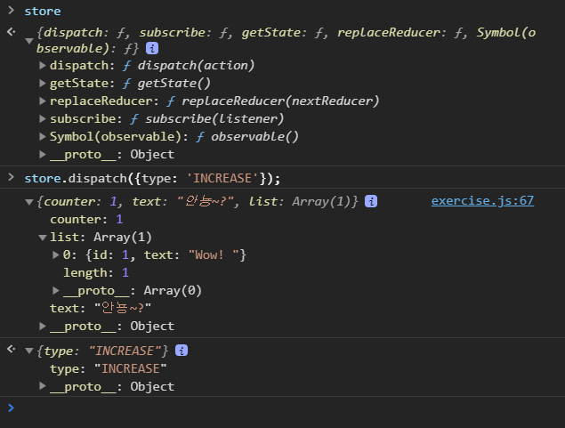

# PRACTICE REACT with Velopert Online Class

## Create React App

- `useState` : 상태 관리
- `useEffect` : 컴포넌트가 마운트 된 이후 또는 업데이트 된 이후 시점 보장
- `useMemo` : 연산된 값을 재사용
- `useCallback` : 특정 함수 재사용
- `React.memo` : props가 바뀌었을 때에만 리렌더링, 렌더링된 결과를 재사용, 최적화

- `useReducer` : action 객체를 기반으로 상태를 업데이트, 상태 업데이트 로직을 컴포넌트 밖으로 분리 가능

  - `action` 객체 : 업데이트 할 때 참조하는 객체
  - `dispatch` : action을 발생시키는 함수
    - `type`: 어떤 업데이트를 할 건지 명시

  ```jsx
  function reducer(state, action) {
    switch (action.type) {
      case "INCREMENT":
        return state + 1;
      case "DECREMENT":
        return state - 1;
      default:
        return state;
    }
  }
  ```

  ```jsx
  const [number, dispatch] = useReducer(reducer, 0);
  ```

- custom `Hook`

---

## React Router

- `SPA` (Single Page Application)

  - 페이지가 1개인 어플리케이션
  - 라우팅을 **클라이언트**가 담당
  - **라우팅**이란? 어떤 주소에 어떤 UI를 보여줄지 규칙을 정하는 일
  - 기존 `non-SPA`는 여러 페이지로 구성되어 있어 사용자가 요청할 때마다 페이지가 새로고침되고, 로딩할 때마다 서버측으로부터 리소스를 전달받고 리소스를 해석 후 렌더링 & 뷰가 어떻게 보여질지 정하는 것도 서버 담당이었음  
    &#8594; 사용자와의 인터랙션이 많은 경우, 서버 자원이 많이 사용되어야 하고 그에따라 불필요한 트래픽 발생
  - `SPA`는 라우팅을 모두 클라이언트에서 담당하여 서버에 요청없이 페이지를 렌더할 수 있음  
    if, 동적인 값이 필요한 경우, 특정 API를 서버측에 요청해서 필요한 데이터만 json형식으로 받아와서 보여줄 수 있음
  - 장점 : 서버 자원을 아낄 수 있음, 좀 더 좋은 사용자 경험을 제공할 수 있음
  - 단점
    1. 앱의 규모가 커지면 js 파일의 크기가 심하게 커질 수 있음  
       &#8594; code splitting으로 해결 가능
    2. 브라우저에서 JS가 구동되지 않으면 UI 볼 수 없음 (ex, 검색엔진에서 크롤링 불가능)  
       JS가 구동되기 전까지 페이지 볼 수 없음 (JS 다운로드 되기 전까지.. 빈화면..)  
       &#8594; server side rendering 기술로 해결 가능

- 리액트 라이브러리

  1.  `react-router`  
      컴포넌트를 기반으로 라우팅 함

  2.  `next.js`
      서버 사이드 렌더링을 쉽게 구현 가능  
      파일 경로, 이름을 기반으로 라우팅 함

- `react-router`의 주요 컴포넌트

  - `<BrowserRouter>` : HTML5 History API 사용, 단순히 주소만 바꾸고 페이지는 다시 불러오지 않음 (서버측에 새로운 요청 안함)
  - `<HachRouter>` : 옛날 라우팅 방식, 주소 뒤에 `#`를 넣음 - 옛날 브라우저에서도 작동함
  - `<MomoryRouter>` : 브라우저의 주소와 무관하기 때문에 브라우저가 아닌 환경에서 쓰기 좋음(ex, 테스트 환경), 주소는 안바뀜
  - `<StaticRouter>` : 서버 사이드 렌더링 할 때 사용
  - `<Route>` : 라우트를 정의할 때 사용하는 컴포넌트 - 어떤 경로로 들어왔을 때 어떤 컴포넌트를 보여줄지 설정
  - `<Link>` : `a`태그로 구성, 새로고침 안되고 Router의 주소만 바꿔줌

- `Route` : 특정 주소에 특정 컴포넌트를 보여주겠다!
- `Link` : 다른 경로로 가고 싶을 때 `a`태그 대신 `Link`를 사용! a 태그는 페이지를 새로 로딩되어 버림. Link는 렌더링만 다시 함

- URL Parameter : 특정 데이터를 조회할 떄 많이 사용 (ex, /profiles/margu)
- Query : 다양한 옵션을 주어 조회를 할 때, 검색할 때 주로 사용 (ex, /filter?type=book&sort_by=data)

- 서브라우트 : tab이 있는 페이지에서 많이 사용

- `history` 객체 : 컴포넌트에서 라우터에 직접 접근 가능, 특정 함수를 호출했을 때 특정 경로로 이동 또는 뒤로 가는 등 페이지 이탈 방지 가능
- `withRouter` 함수 : 라우터 컴포넌트가 아닌 곳에서 match, location, history를 props로 받아와서 사용할 수 있게 해줌 (조건부로 이동해야할 때 자주 사용 ex, 로그인 성공했을 때 특정 경로로 가랏!)

- `Switch` 컴포넌트 : 여러 라우트 중 가장 먼저 매칭된 라우트 하나만을 보여줌, 페이지를 못 찾았을 때, not found 페이지를 보여줄 때 유용
- `NavLink` 컴포넌트 : 해당 링크의 주소가 현재 주소와 일치하면 특별한 스타일 지정

- `Prompt` 컴포넌트 : 사용자 이탈 방지
- `Redirect` 컴포넌트 : 해당 컴포넌트를 렌더링 하는 순간 다른 경로로 이동
- `Route Config` : 배열로 path 사전 정의

- `useReactRouter Hook`

---

## Redux

리액트 생태계에서 가장 사용률이 높은 상태 관리 라이브러리
Context API + useReducer와 매우 유사

- Context를 사용하는 것과의 차이점?

  1. 미들웨어 : 비동기 작업을 더욱 더 체계적으로 관리 가능
  2. 유용한 함수와 Hooks 지원 받을 수 있음  
     ex, `connet`, `useSelector`, `useDispatch`, `useStore`
  3. 기본적인 최적화가 이미 되어있음
  4. 모든 글로벌 상태를 하나의 커다란 객체로 만들어 사용
  5. DevTools : 현재 상태를 한눈에 볼 수 있음, 지금까지 어떤 변화가 있었는지 알 수 있고, 특정 시점으로 상태 되돌릴 수도 있음
  6. 이미.. 리덕스를 사용중인 프로젝트가 많음

- 리덕스는 언제 써야할까?

  - 프로젝트의 규모  
    크다? Redux
    크지 않다? Context API
  - 비동기 작업 빈도수  
    많다? Redux (+ middleware)
    많지 않다? Context API
  - 리덕스가 편하냐!?

- Keywords

  1. `Action` 객체 : type (필수), 어떻게 업데이트를 할 지 정의

  ```js
  {
    type: 'CHANGE_INPUT',
    text: '안뇽~?'
  }
  ```

  2. `Action Creator` 함수 : 파라미터를 받아서 액션 객체를 만들어주는 함수

  ```js
  export function addTodo(data) {
    return {
      type: "ADD_TODO",
      data,
    };
  }
  // 화살표 함수도 가능
  export const changeInput = (text) => ({
    type: "CHANGE_INPUT",
    text,
  });
  ```

  3. `Reducer`
     - 변화를 일으키는 함수로 state와 action 파라미터를 받음
     - action 타입이 무엇이냐에 따라 업데이트 작업
     - 불변성 유지!

  ```js
  function counter(state, action) {
    switch (action.type) {
      case "INCREASE":
        return state + 1;
      case "DECREASE":
        return state - 1;
      default:
        // 기존 reducer는 default에 에러를 발생시키는게 일반적이지만,
        // 리덕스의 reducer는 기존의 state를 그대로 반환!
        // 여러개의 리듀서를 합쳐 루트 리듀서를 만들기 때문
        return state;
    }
  }
  ```

  4. `Store`
     - 하나의 애플리케이션 당 하나의 스토어!
     - 스토어 안에는 현재 앱의 상태와 reducer가 들어있음
  5. `dispatch` : store 내장 함수 중 하나로 액션을 발생시킴 (액션을 스토어한테 전달) - `dispatch({ type: 'INCREASE' })`
  6. 구독 `subscribe` : store의 내장 함수 중 하나로 액션이 디스패치 되었을 때 마다 전달해준 함수가 호출

- 리덕스의 3가지 규칙
  1. 하나의 애플리케이션에 하나의 스토어만!
  2. 상태는 읽기 전용! 불변성을 지켜야한다!
  3. 변화를 일으키는 reducer는 순수 함수여야 한다  
     리듀서 함수는 이전 상태와 액션 객체를 파라미터로 받음
     이전 상태는 변경 No! 새로운 상태 객체를 만들어 반환해야 함
     동일한 파라미터로 호출된 리듀서는 언제나 똑같은 결과값을 반환해야한다
     - new Date(), Math.random(), axios.get() 같은 함수 쓰지마~

---

- store, subscribe, dispatch

```js
import { createStore } from "redux";

const initialState = {
  counter: 0,
  text: "",
  list: [],
};

const INCREASE = "INCREASE";
const DECREASE = "DECREASE";
const CHANGE_TEXT = "CHANGE_TEXT";
const ADD_TO_LIST = "ADD_TO_LIST";

const increase = () => ({ type: INCREASE });
const decrease = () => ({ type: DECREASE });
const changeText = (text) => ({ type: CHANGE_TEXT, text });
const addToList = (item) => ({ type: ADD_TO_LIST, item });

function reducer(state = initialState, action) {
  switch (action.type) {
    case INCREASE:
      return {
        ...state,
        counter: state.counter + 1,
      };
    case DECREASE:
      return {
        ...state,
        counter: state.counter - 1,
      };
    case CHANGE_TEXT:
      return {
        ...state,
        text: action.text,
      };
    case ADD_TO_LIST:
      return {
        ...state,
        list: state.list.concat(action.item),
      };
    default:
      return state;
  }
}

const store = createStore(reducer);
// 현재 store 안에 있는 상태 조회 -> store.getState()
// console.log(store.getState());

const listener = () => {
  const state = store.getState();
  console.log(state);
};

// 구독
const unsubscribe = store.subscribe(listener);
// 구독 해제
// unsubscribe();

store.dispatch(increase());
store.dispatch(decrease());
store.dispatch(changeText("안뇽~?"));
store.dispatch(addToList({ id: 1, text: "Wow! " }));

// 아래 코드 작성하고 콘솔 창에서 store 치면 store안에 들어있는거 볼 수 있음
// {dispatch: ƒ, subscribe: ƒ, getState: ƒ, replaceReducer: ƒ, Symbol(observable): ƒ}
window.store = store;
```



---
